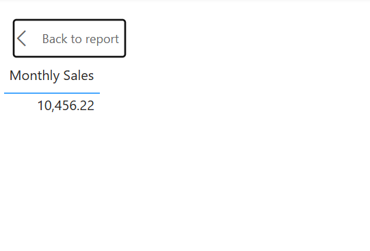
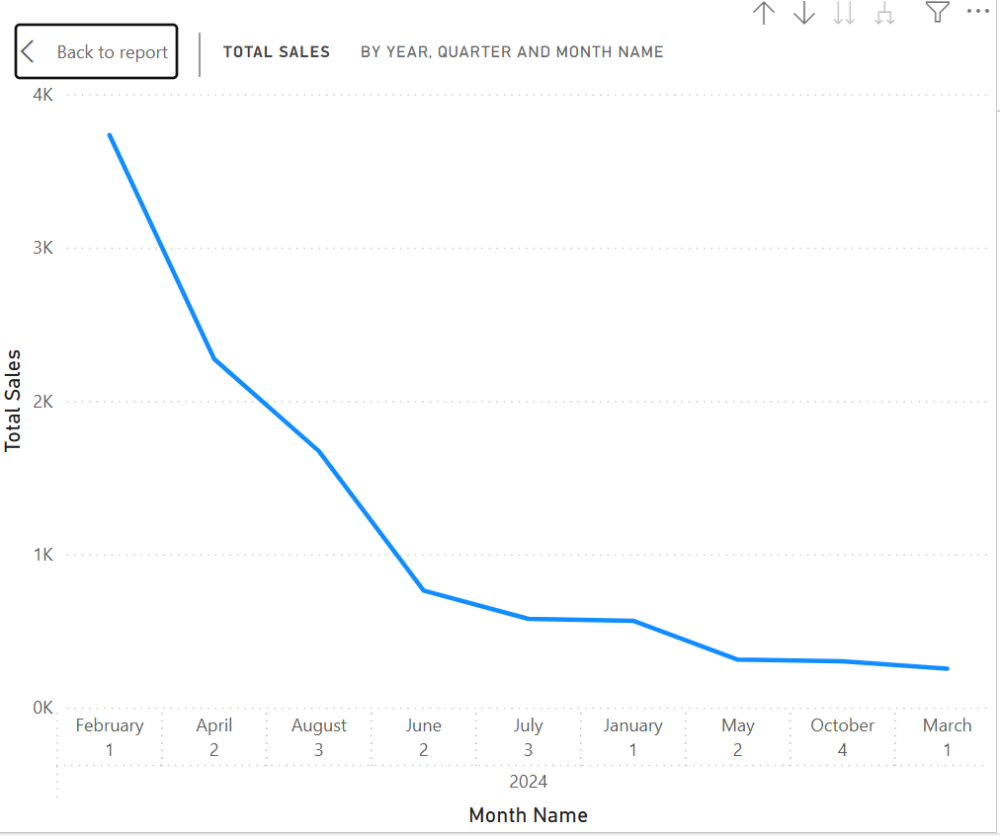
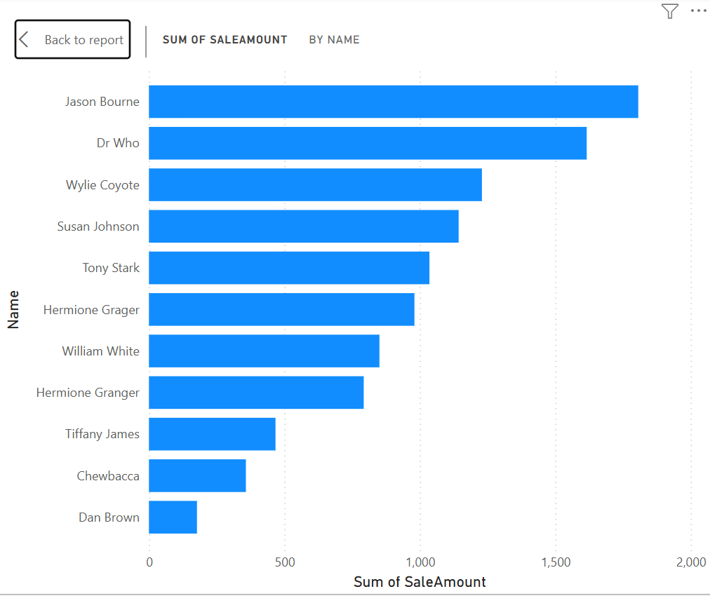
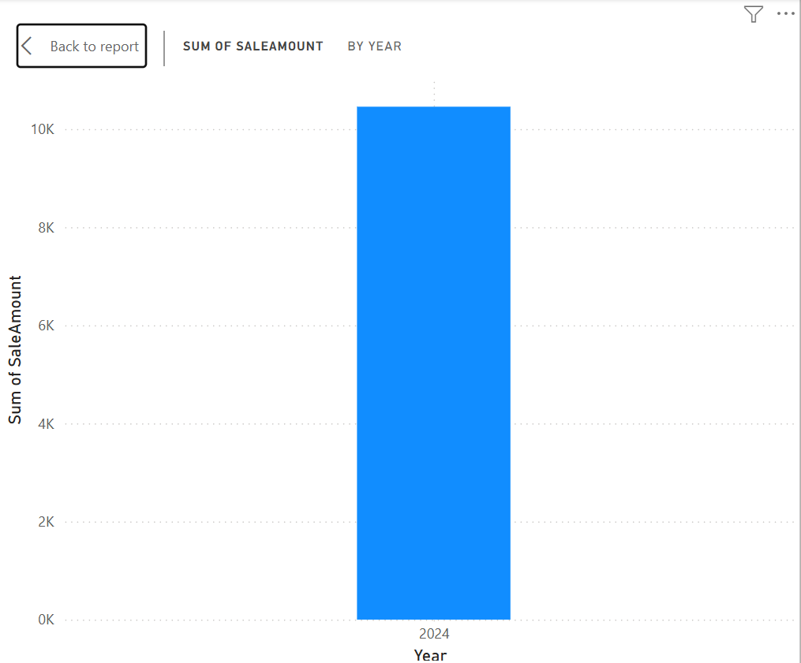
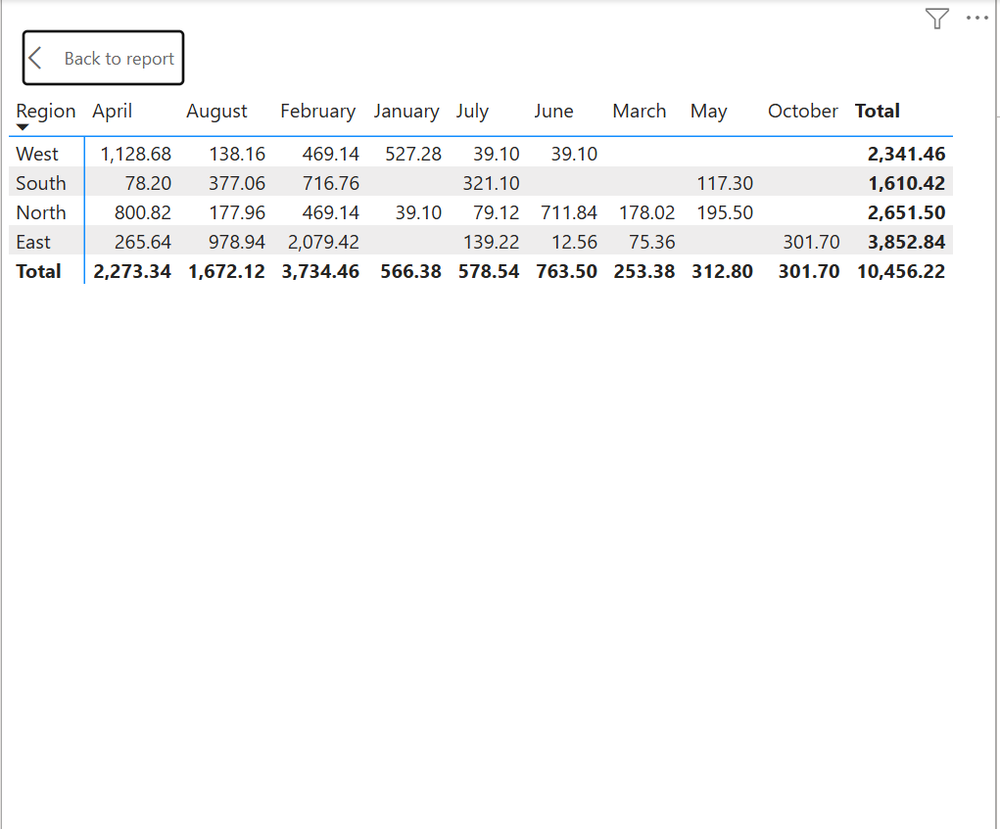
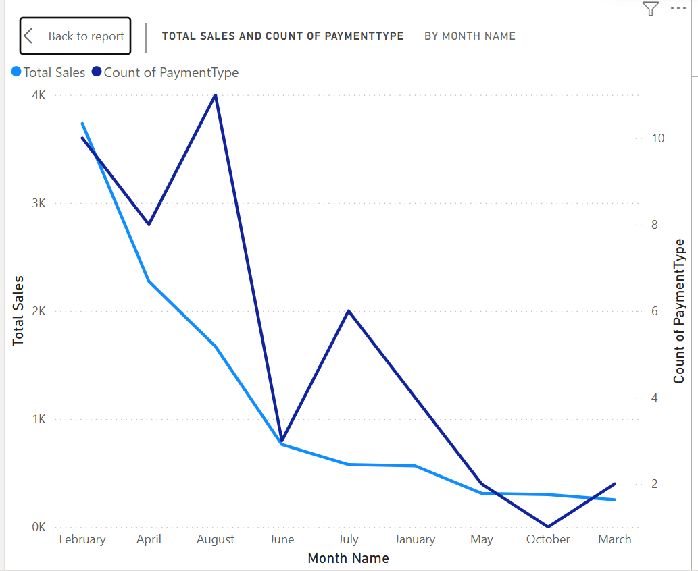
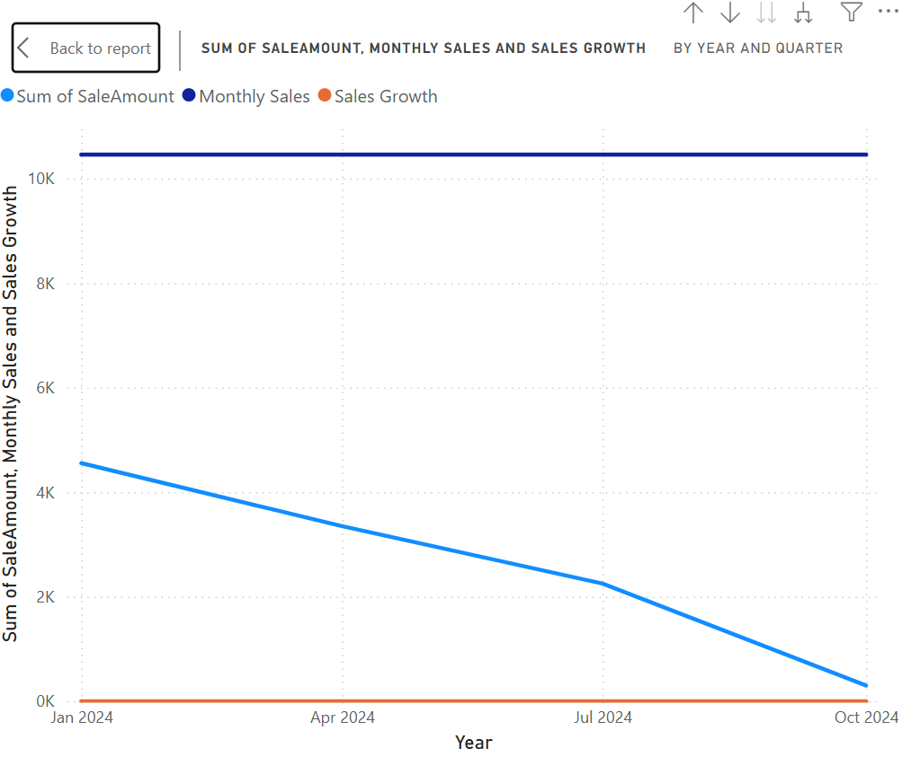

# smart-store-foster
# Exploring Business Intelligence
## Author: Lindsay Foster
## Date: March 2025
# Create 
Create a repository in GitHub. Open in VS Code. Add .gitignore and requirements.txt. Create a virtual environment and open it. Create folders, data with prepared and raw subfolders, utils folder with subfolder logger.py. Then download the 3 CSV files and put them in the raw folder. 
# Install requirements
Pip install, then also install requirements.txt. 
# Create utils/logger.py
In VS Code, use File / New Folder to create a new folder named utils to hold utility scripts. In this folder, create a file named logger.py. Copy and paste the content from the starter repo.
# Create scripts/data_prep.py
In VS Code, use File / New Folder to create a new folder named scripts to hold scripts. In this folder, create a file named data_prep.py. Copy and paste the content from the starter repo.
I could not find the data_prep.py file at first so I asked ChatGPT to help create a data prep file to do basic data cleaning and then ran that. 
# Git Add
`git add. 
git commit -m "message"
git push'
# Don't forget the .gitignore
Add the requirements for the gitignore file.
# Clean Data
Clean and prepare each csv file by creating a python file with the code to clean the data. Then save that cleaned data as a new csv file in the prepared folder. 
# Fake Data
Open each csv file in Excel and add:
1. Customers Data
Customer Numeric: LoyaltyPoints (numeric)
Customer Category: CustomerSegment (category)
2. Product Data
Products Numeric: StockQuantity (numeric)
Products Category: Supplier (category)
3. Sales Data
Sales Numeric: DiscountPercent (numeric)
Sales Category: PaymentType (category)
Then save these files under the same name. 
# Cleaning and Preparing Data: sales_data.csv Example
1. Load Data: Reads the sales_data.csv file into a Pandas DataFrame.
2. Verify Columns: Checks if the dataset has the correct columns, as expected.
3. Remove Duplicates: Removes duplicate rows from the dataset.
4. Handle Missing Data: Fills any missing values in the dataset for key columns like SaleAmount and DiscountPercent.
5. Remove Duplicate Columns: Drops any duplicate columns, particularly those with .1 (e.g., DiscountPercent.1).
6. Ensure Correct Data Types: Ensures columns like SaleAmount and DiscountPercent are of numeric type.
7. Remove Outliers: Identifies and removes outliers in the SaleAmount and DiscountPercent columns based on the interquartile range (IQR).
8. Save Cleaned Data: Saves the cleaned data to a new CSV file, ex.: sales_data_prepared.csv.

# Step-by-Step Breakdown of DataScrubber
1. Review the DataScrubber Class:
Complete the TODO in the file data_scrubber.py: Fix the following logic to call str.upper() and str.strip() on the given column.
For each TODO in the DataScrubber class, you need to: Understand what the method is supposed to do and complete the method logic (e.g., fixing the string formatting, handling missing data, etc.).
2. Unit Testing
Objective: After implementing or fixing the methods in the DataScrubber class, you need to verify that everything works correctly by running tests.After completing the DataScrubber methods:
Open tests/test_data_scrubber.py and run the tests to check if all methods in your class pass.
3. Ensure All Tests Pass:
After running the tests, verify that all of them pass (100%). This means that each cleaning method you implemented is functioning as expected. If any test fails, it will tell you what part of your DataScrubber class needs to be fixed. Modify your code as needed: If a test fails, go back and tweak the relevant method in the DataScrubber class and run the tests again.
4. Use the DataScrubber in a Data Preparation Script:
Once your DataScrubber class is working and all tests pass, you will use the DataScrubber class in your data prep script.This means you will import the class and use it to clean your data.

# Use Data Scrubber 

Create Main Data Prep script(s):

scripts/data_prep_cutomers.py
scripts/data_prep_products.py
scripts/data_prep_sales.py

Data Cleaning Steps: Removed duplicate rows, cleaned column names by stripping spaces, trimmed whitespace from the 'Name' column and dropped rows with missing CustomerID or Name, used the DataScrubber class to handle missing data, check consistency, and parse the JoinDate column as a datetime.

Logging: Added logging messages to track the progress of the data preparation process for the customer data.
Run the Script: process the the csv files and save the cleaned data to prepared_file_data.csv.

# Create and Populate DW
1. Define SQL Schema: Write SQL statements to create the tables, set up relationships, and add primary and foreign keys.

2. Load Data: Use Python to load data from CSV files into the database.
Create the customers, products, and sales tables in sql. Once the tables are correct, you can run a script to create the data warehouse. 

3. Run Script 
    import pandas as pd
    import sqlite3
    import pathlib

### Explanation of the Python Code:
We import pandas for reading CSV files and sqlite3 for interacting with the SQLite database.

Create Schema: The create_schema() function creates the tables (customers, products, and sales) using SQL CREATE TABLE statements.

Load Data: The load_data_to_db() function reads data from the prepared CSV files (customers_data.csv, products_data.csv, and sales_data.csv) and loads it into the SQLite database using pandas.DataFrame.to_sql().

Running the Code: Ensure that your CSV files are in the correct prepared/ folder and that the SQLite database file is located in dw/.

Run the script in VS Code by opening the terminal and execute.
This will; create the database (sales_warehouse.db) if it doesn’t exist, create the tables (customers, products, and sales) and insert data from the CSV files into the corresponding tables.

# If using Mac: Cross-Platform Reporting with Spark 

## Setup Spark
Install Apache Spark
Download the SQLite JDBC Driver from https://github.com/xerial/sqlite-jdbcLinks to an external site.
Follow the Usage instructions in the README. Download the .jar file. I make a lib folder in my project repository and put it there. 
Set up SQLite JDBC Driver
Verify PySpark works in Jupyter Notebook

## Connect to Data Warehouse and Load Tables
Start a Jupyter Notebook
Connect to SQLite using PySpark
Verify tables are loaded

## Query & Aggregate Data
Write a Spark SQL query for total revenue per customer.
Store the results in a Pandas DataFrame for visualization.
Review the results.

## Slice, Dice, and Drilldown
Slicing: Filter sales by date range
Dicing: Group sales by product & region
Drilldown: Aggregate sales by year → quarter → month

## Create Interactive Visualizations (Python, Seaborn, Matplotlib)
Create a bar chart for Top Customers
Create a line chart for Sales Trends

## Document
Update README.md

Describe your SQL queries and reports.
Explain dashboard design choices.
Include screenshot of: Power BI Model View / Spark SQL Schema
Include screenshot of: Query results
Include screenshot of: Final Dashboard / Charts

Git Add-Commit-Push

# If Using Windows: Power BI and Visualizations
## OLAP Dashboard

The Power BI file used for OLAP analysis is located in the [`olap/`](./olap/) folder:
- **dashboard.pbix**: Contains all OLAP slicing, dicing, and drilldowns for sales growth analysis.

> If you cannot view the `.pbix` file directly here, open it using [Power BI Desktop](https://powerbi.microsoft.com/desktop/).


## Sales Growth Over Time – OLAP Analysis

### Project Goal

**How is sales revenue changing over time, and are there any seasonal or monthly patterns we can identify?**

This analysis focuses on identifying sales growth trends, seasonal spikes, and product/region-specific performance using both Power BI and Python.

---

### Tools Used

- **Power BI** – for drag-and-drop OLAP visualizations, slicing, dicing, and drilldowns
- **Python (Pandas, Seaborn, Matplotlib)** – for scripted visualizations, transformations, and deeper validation
- **SQLite** – data warehouse backend for storing sales data
- **Jupyter Notebooks / VS Code** – to write and test Python queries and visuals

---

## Data Overview

Tables used:
- `sale` – Sales data (amounts, dates, product/customer IDs)
- `customer` – Customer information including region
- `product` – Product details including category

Note: ProductID in the `sale` table had an offset of +100, which we adjusted to join correctly with the `product` table.

---

## Step-by-Step Process

### 1. Prepare the Data

## Querying the Data
```python
import pandas as pd
import sqlite3

conn = sqlite3.connect('../data/dw/smart_sales.db')

df = pd.read_sql_query("""
SELECT 
    s.SaleAmount, 
    s.SaleDate, 
    c.Region, 
    p.Category,
    c.Name AS CustomerName,
    s.PaymentType
FROM sale s
LEFT JOIN customer c ON s.CustomerID = c.CustomerID
LEFT JOIN product p ON (s.ProductID - 100) = p.ProductID
""", conn)
```
We also extracted: Year, Month Name, and Quarter from the SaleDate column:
```python
df['SaleDate'] = pd.to_datetime(df['SaleDate'])
df['Year'] = df['SaleDate'].dt.year
df['Month Name'] = df['SaleDate'].dt.strftime('%B')
df['Quarter'] = df['SaleDate'].dt.to_period("Q").astype(str)
```
## Filter for 2024 Data
```python
df_2024 = df[df['Year'] == 2024].copy()
```
## Perform OLAP Analysis
🔹 Slicing – Sales by Product Category (2024)
```python
category_sales = df_2024.groupby('Category')['SaleAmount'].sum().reset_index()

sns.barplot(data=category_sales, x='Category', y='SaleAmount')
plt.title('Total Sales by Product Category (2024)')
plt.xticks(rotation=45)
plt.tight_layout()
plt.show()
```
## Dicing – Sales by Region per Month (2024)
```python
month_order = ['January', 'February', 'March', 'April', 'May', 'June',
               'July', 'August', 'September', 'October', 'November', 'December']
df_2024['Month Name'] = pd.Categorical(df_2024['Month Name'], categories=month_order, ordered=True)

monthly_region_sales = df_2024.groupby(['Region', 'Month Name'])['SaleAmount'].sum().reset_index()

sns.lineplot(data=monthly_region_sales, x='Month Name', y='SaleAmount', hue='Region', marker='o')
plt.title('Monthly Sales by Region (2024)')
plt.xticks(rotation=45)
plt.tight_layout()
plt.show()
```
## Drilldown – Monthly Sales % Growth by Region
```python
monthly_region_sales.sort_values(['Region', 'Month Name'], inplace=True)
monthly_region_sales['% Growth'] = monthly_region_sales.groupby('Region')['SaleAmount'].pct_change() * 100
monthly_region_sales['% Growth'] = monthly_region_sales['% Growth'].round(2)

sns.lineplot(data=monthly_region_sales, x='Month Name', y='% Growth', hue='Region', marker='o')
plt.title('Month-over-Month % Sales Growth by Region (2024)')
plt.axhline(0, color='gray', linestyle='--')
plt.xticks(rotation=45)
plt.tight_layout()
plt.show()
```












Final Output
Power BI dashboards

Jupyter Notebook visualizations

Clean SQLite join and date-derived dimensions

# Business Questions Answered
Which regions show the most consistent sales growth year over year?
The North is most consistent with sales but the East sells the most.

Do certain product categories drive most of the growth?
Electronics is the primary growth driver, while Clothing is secondary growth, especially in April. Sports has a minor role early in the year but doesn't continue.

Are there seasonal spikes in sales (e.g., Q4)?
Sales spike in the winter months and decrease in the summer months.

What months had the highest/lowest sales in 2024?
Highest in February, lowest in March.

# Summary
This analysis provided strong insight into sales trends over time, helped detect seasonality, and revealed growth drivers by region and product — all critical for better business forecasting and planning.

Sources, Process, and Results:
Sources:
I used the Smart Sales dataset, which includes sales transactions with fields like SaleDate, SaleAmount, ProductID, Region, and PaymentType. Supplementary data like product details and customer info were also used.

Process:
I cleaned and prepared the data using Python and pandas, then loaded it into Power BI for OLAP operations. I created calculated columns for Year, Quarter, and Month, and built dashboards to slice and dice sales data over time. I performed drilldowns from year → quarter → month to analyze trends. The same visualizations and insights were replicated in Python for validation.

Results:
The analysis revealed key trends such as seasonal sales spikes, strong growth in certain product categories, regional performance variations, and  trends over specific months. The final dashboard helps stakeholders quickly explore sales patterns and make informed decisions.

Update README.md

Git Add-Commit-Push